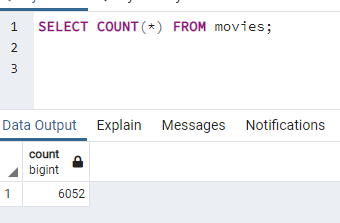
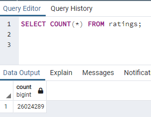

# Movies-ETL  - Module 8 Challenge
Module 8 ETL

## Overview of the Analysis

The purpose of this analysis is to create a database in preparation for a hackathon using the Extract, Transform and Load process, combining data from Wikipedia and Kaggle. Programming methods such as lambda functions, try except blocks and list comprehensions were used to process and clean the data. The process was fed into a function so it could be used on a daily basis, automated for future information.

## Resources Used
- Data Source: movies_metadata.csv, ratings.csv, wikipedia-movies.json
- Software: PostgreSQL 11.15, pgAdmin 4 6.1, Python 3.7.6, Visual Studio Code 1.63.2, Conda 4.11.0, Jupyter Notebook 6.4.6

## Results

The functions were tested against the provided dataset and verified to process all the data supplied, proken in various steps uploaded to the github from ETL_function_test.ipynb, ETL_clean_wiki_movies.ipynb, ETL_clean_kaggle_data.ipynb and ETL_create_database.ipynb. The first file indicated the extraction part of the process, the next two indicating the transformation part via cleaning and filtering useable data from the wikipedia and kaggle information, and the final step showed the loading process into PostgreSQL added to the code.

Two images were created of query output to verify the input of data into PostgreSQL using PGAdmin, as shown.

